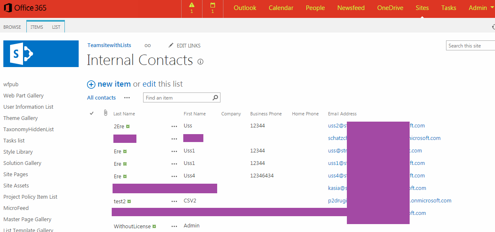

Short C# application.

It retrieves all the users and creates a contact list with  

**"LastName"**

**"FirstName"**

**"WorkEmail"**

**"WorkPhone"**

**"CellPhone"**

Screenshot with test data

Technicalities:

The application retrieves all users from tenant-my.sharepoint.com. That means that if a user didn't create his personal site, he will not be retrieved.

 

 

It wouldn't exist without:

http://social.technet.microsoft.com/wiki/contents/articles/24627.sharepoint-online-export-user-profile-properties-using-csom.aspx 
